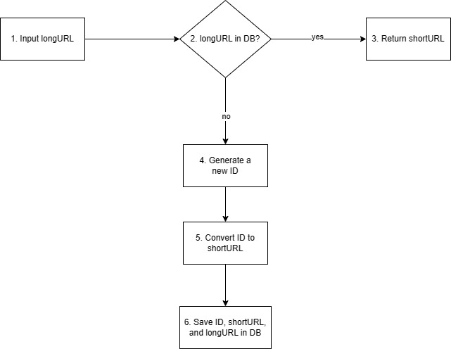
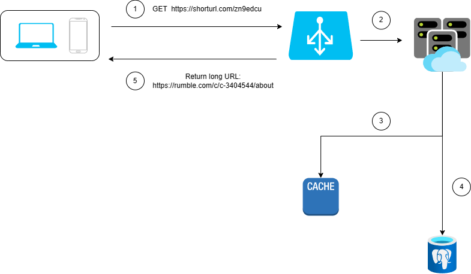

# Shorturl design doc 

The URL shortener service is web-based appliaction that allows users to shorten long URLs into shorter and more manageable links. This service aims to provided convenience and simplicity for sharing URLs. 

## Tech stack

CLI: Go, Cobra, Viper
Frontend: Go, HTML, CSS
Backend: Go
Database: Postgres
Deployment: Docker, Kubernetes

## High-level system flow

1. longURL is the input.
2. The system checks if the longURL is in the database.
3. If it is, it means the longURL was convered to a shortURL before. In this case, fetch the shortURL from the database and return it to the client.
4. If not, the longURL is new. A new unique ID (primary key) is generated by the unique ID generator.
5. Convert the ID to shortURL with base 62 conversion.
6. Create a new database row with the ID, shortURL, and longURL.

## API endpoints

1. URL shortening. To create a new short URL, a client sends a POST request, which contains one parameter: the original long URL. The API looks like this:

**POST** _api/v1/data/shorten_

- request parameter: {longUrl: longURLString}
- return shortURL

2. URL redirecting. Toe short URL to the corresponding long URL, a client sends a GET request. The API looks like this:

**GET** _api/v1/shortUrl_

- Return longURL for HTTP redirection

## URL redirecting

1. A users clicks a short URL link.
2. The load balancer forwards the request to the web servers.
3. If a shortURL is already in the cache, return the longURL directly.
4. If a shortURL is not in the cache, fetch the longURL from the database. If it is not in the database, it is likely the user entered an invalid shortURL.
5. The longURL is returned to the user.

- Use 301 redirect for simplicity.

## URL shortening

Hash function requirements:

- Each _longURL_ must be hashed to one _hasValue_.
- Each _hashValue_ can be mapped back to the _longURL_.
- Hash value length should be of a fixed length of 7.
- Base 62 conversion will be used for the conversion to a shorturl.

## Data model

Table: URL
+----+-------------+--------------------+
| id | short_url   | long_url           |
+----+-------------+--------------------+
| 1  | abc123      | https://example.com |
+----+-------------+--------------------+

